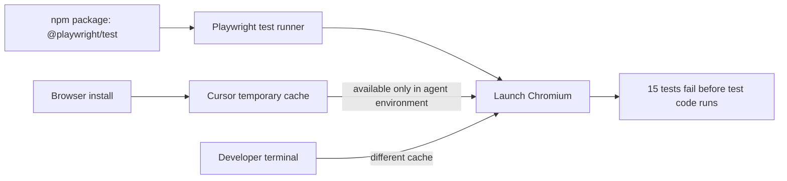

# E2E Workflow Hardening

Date: August 19, 2026  
Issue directory: `081926-e2e-workflow-hardening`

## Why this plan exists

The Kita-Kita Playwright E2E suite appeared healthy in an agent-run verification, but running the same command from the developer's terminal produced 15 failures. The failures were initially easy to misinterpret because every test was reported as failed even though none of the test scenarios had started.

The actual error was:

```text
browserType.launch: Executable doesn't exist
```

`@playwright/test` was installed as an npm dependency, but Playwright browser binaries are separate runtime dependencies. The agent had installed Chromium into Cursor's temporary sandbox cache, and the agent's later test run reused that cache. The developer's normal terminal used a different environment and could not see that binary. The project configuration started Expo Web but did not provision or validate the browser runtime.

This document records the context so future maintenance does not treat an agent-only green run as proof that a fresh developer checkout is runnable.

## Root cause



The project had the runner but lacked a reproducible browser-provisioning contract:

- `package.json` declared `@playwright/test`.
- `playwright.config.ts` configured Chromium and the Expo Web server.
- The test command did not originally install or verify Chromium.
- Browser state was external to the repository and differed between environments.

## Guardrails implemented

The workflow-hardening plan is now implemented:

1. `PLAYWRIGHT_BROWSERS_PATH=0` stores Chromium with the local Playwright installation instead of an environment-specific cache.
2. `scripts/ensure-playwright-browser.js` provisions Chromium and reports actionable setup errors.
3. `scripts/run-playwright.js` routes headless, UI, headed, and debug commands through the same preflight path.
4. `e2e/global-setup.ts` checks the configured Expo Web URL after the Playwright web server starts.
5. The root README documents first-run behavior and troubleshooting.
6. `.github/workflows/quality.yml` runs dependency installation, browser provisioning, unit tests, privacy checks, and E2E tests together.
7. Generated Playwright reports and test artifacts are ignored by `.gitignore`.

## Intended command contract

From a clean checkout, these commands should be sufficient:

```bash
npm ci
npm run test:e2e
```

The first E2E run may download Chromium. Subsequent runs should reuse the project-local browser installation. UI debugging must use the same provisioning path:

```bash
npm run test:e2e:ui
```

## Verification results

- `npm run test:e2e`: 15 tests passed.
- `npm test -- --runInBand`: 28 tests passed.
- `npm run privacy-check`: passed with no blocking violations.
- `npm run test:e2e:ui -- --help`: confirmed the UI command uses the shared preflight wrapper.
- `npm run test:e2e:headed -- --list`: confirmed the headed command uses the shared preflight wrapper.

`npx tsc --noEmit` still reports pre-existing project type errors, including Jest global typing and unrelated meeting edit-screen errors. TypeScript compilation is not currently part of the CI workflow or this plan's acceptance criteria.

## Related files

- [Playwright configuration](../../playwright.config.ts)
- [Package scripts](../../package.json)
- [Browser preflight](../../scripts/ensure-playwright-browser.js)
- [Playwright runner wrapper](../../scripts/run-playwright.js)
- [CI workflow](../../.github/workflows/quality.yml)
- [Root development documentation](../../README.md)
- [Ignored test artifacts](../../.gitignore)
