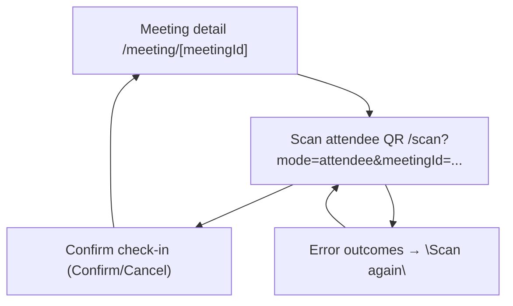
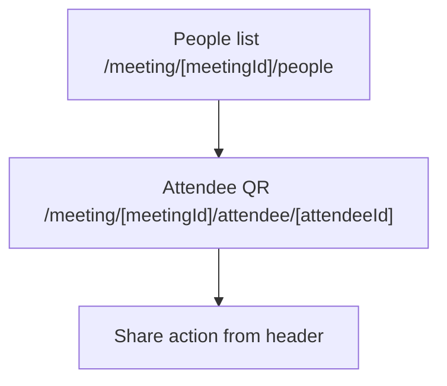
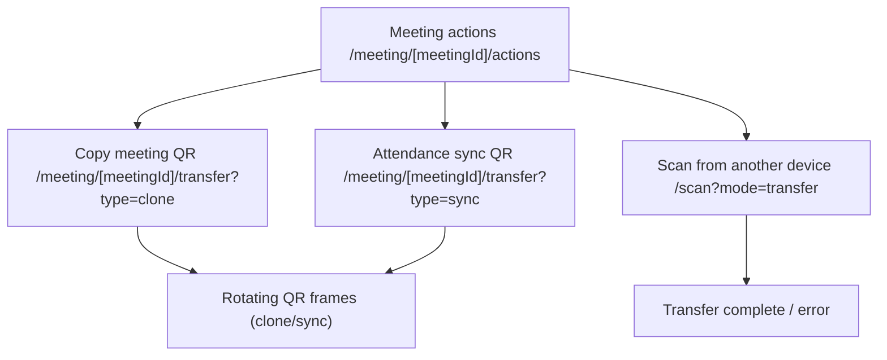

# App flow diagrams (committed user journeys)

This document is the **canonical, committed map** of how users move through Kita-Kita.
Agents should read it before changing a user journey, and should only update it after the
journey’s blast-radius code has been committed and verified by E2E/unit tests.

## Journey IDs (used by rules)

- `create-meeting-with-people`: empty Meetings list → meeting + multiple people
- `check-in`: meeting detail → scan attendee QR → confirm check-in outcomes
- `attendee-qr`: people list → view/share an attendee QR
- `device-transfer`: meeting actions → view transfer QR / synchronize via QR frames

## Route map (current Expo Router)

- Meetings home: [`src/app/(tabs)/index.tsx`](../src/app/(tabs)/index.tsx) → `/`
- Create meeting form: [`src/app/create-meeting.tsx`](../src/app/create-meeting.tsx) → `/create-meeting`
- Meeting detail hub: [`src/app/meeting/[meetingId]/index.tsx`](../src/app/meeting/[meetingId]/index.tsx) → `/meeting/[meetingId]`
- Meeting edit: [`src/app/meeting/[meetingId]/edit.tsx`](../src/app/meeting/[meetingId]/edit.tsx) → `/meeting/[meetingId]/edit`
- Meeting people list (+ CSV import): [`src/app/meeting/[meetingId]/people.tsx`](../src/app/meeting/[meetingId]/people.tsx) → `/meeting/[meetingId]/people`
- Add/edit attendee: [`src/app/meeting/[meetingId]/person.tsx`](../src/app/meeting/[meetingId]/person.tsx) → `/meeting/[meetingId]/person`
- Attendee QR view (share): [`src/app/meeting/[meetingId]/attendee/[attendeeId].tsx`](../src/app/meeting/[meetingId]/attendee/[attendeeId].tsx) → `/meeting/[meetingId]/attendee/[attendeeId]`
- Meeting actions (transfer/clear/delete): [`src/app/meeting/[meetingId]/actions.tsx`](../src/app/meeting/[meetingId]/actions.tsx) → `/meeting/[meetingId]/actions`
- Transfer QR display: [`src/app/meeting/[meetingId]/transfer.tsx`](../src/app/meeting/[meetingId]/transfer.tsx) → `/meeting/[meetingId]/transfer`
- Camera scanner: [`src/app/scan.tsx`](../src/app/scan.tsx) → `/scan?mode=attendee|transfer&meetingId=...`

## `create-meeting-with-people`

```mermaid
flowchart TD
  home["Meetings home / (empty → shows \"No meetings yet\")"] --> createMeeting["Create meeting /create-meeting"]
  createMeeting --> detail["Meeting detail /meeting/[meetingId]"]
  detail --> people["People list /meeting/[meetingId]/people"]
  people --> addPerson["Add person /meeting/[meetingId]/person"]
  people --> importCsv["Import CSV (on people screen) /meeting/[meetingId]/people"]
  addPerson --> people
  people --> detail
```

### Screens in this journey

- Empty state copy + CTA:
  - `src/app/(tabs)/index.tsx` shows:
    - empty copy: **“No meetings yet.”**
    - CTA: header action **“Add meeting”** (plus icon) that routes to `/create-meeting`
- Meeting creation:
  - `src/app/create-meeting.tsx` collects meeting name, date, start/end time, location
- Meeting detail:
  - `src/app/meeting/[meetingId]/index.tsx` shows:
    - `0 of 0 expected` when no attendees exist yet
    - entry points to **Scan attendee QR**, **Manage people**, and **Meeting actions**
- Attendee management:
  - `src/app/meeting/[meetingId]/people.tsx`
    - list empty copy: **“No attendees yet.”**
    - CTA(s): header **Add person** and **Import CSV**
  - `src/app/meeting/[meetingId]/person.tsx` (add/edit attendee form)

### E2E coverage (Playwright)

| Journey step coverage | Included in |
|---|---|
| Create meeting, open meeting detail, see scan/manage/action buttons | `e2e/meetings.spec.ts` |
| Add multiple attendees, verify people list UI + masking, search/filter, edit/delete QR view | `e2e/attendees.spec.ts`, `e2e/attendance.spec.ts` |
| Persistence across hard reload | `e2e/persistence.spec.ts` |

## `check-in`



### Screens in this journey

- Open scanner:
  - `src/app/meeting/[meetingId]/index.tsx` button **“Scan attendee QR”** → `/scan`
- Scan outcomes and confirmation UI:
  - `src/app/scan.tsx`
    - permission gate screen when camera permission is denied
    - outcome UI branches:
      - invalid QR / unknown meeting / not on list / already checked in
      - match → **“Confirm check-in”** with equal **Confirm** / **Cancel** buttons
      - checked in → **“Scan next”**

### E2E coverage (Playwright)

| Journey step coverage | Included in |
|---|---|
| Meeting detail renders the **Scan attendee QR** entry point | `e2e/meetings.spec.ts` |
| Attendance summary/count logic + meeting actions navigation + clear check-ins | `e2e/attendance.spec.ts` |
| Open scanner, camera permission gate copy, Close back to meeting detail | `e2e/attendance.spec.ts` (`Check-in scanner UI`) |
| Idle scan instructions when camera is granted (attendee mode) | `e2e/attendance.spec.ts` (`Check-in scanner UI`) |
| Live barcode decode via `expo-camera` (`onBarcodeScanned` match/not-on-list/confirm) | Not automated today (tests do not drive camera payloads) |

## `attendee-qr`



### Screens in this journey

- `src/app/meeting/[meetingId]/people.tsx`
  - per-row action **“QR”** routes to `/meeting/[meetingId]/attendee/[attendeeId]`
- `src/app/meeting/[meetingId]/attendee/[attendeeId].tsx`
  - generates encrypted attendee QR value and provides a **Share** action

### E2E coverage (Playwright)

| Journey step coverage | Included in |
|---|---|
| Open attendee QR screen and verify header actions | `e2e/attendees.spec.ts` |

## `device-transfer`



### Screens in this journey

- Entry point:
  - `src/app/meeting/[meetingId]/actions.tsx`
    - **Show attendance QR** → `/meeting/[meetingId]/transfer?type=sync`
    - **Copy meeting QR** → `/meeting/[meetingId]/transfer?type=clone`
    - **Scan from another device** → `/scan?mode=transfer`
- Transfer QR display:
  - `src/app/meeting/[meetingId]/transfer.tsx` rotates QR frames every ~300ms
- Transfer apply + status:
  - `src/app/scan.tsx` in `mode=transfer` collects frames, applies them, and shows:
    - **Transfer complete** or **Transfer failed**

### E2E coverage (Playwright)

| Journey step coverage | Included in |
|---|---|
| Navigate to meeting actions and open transfer QR display screens | `e2e/attendance.spec.ts` |
| Open transfer scanner and show idle transfer scan instructions (camera granted) | `e2e/attendance.spec.ts` (`Check-in scanner UI`) |
| Actual frame capture + transfer application via `expo-camera` payloads | Not automated today (tests do not drive camera payloads) |

